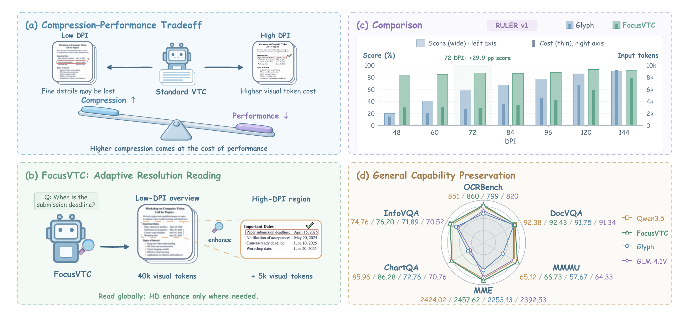
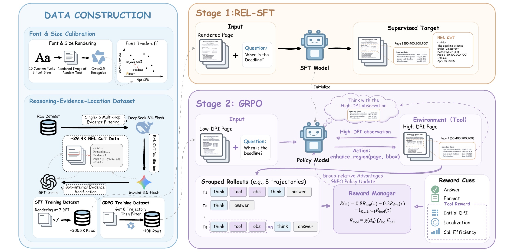

<div align="center">

# FocusVTC

### Efficient and High-Performance Visual Text Compression with Adaptive Resolution

**Read compressed pages. Locate evidence. Enhance the regions you need.**

[](https://huggingface.co/zfz04/FocusVTC)
[](https://www.modelscope.cn/datasets/zhongfangzhi/REL-CoT)
[](https://github.com/fangzhi-zhong/FoucsVTC)

**Paper:** [arXiv:2609.36651](https://arxiv.org/abs/2609.36651)

[Introduction](#introduction) · [Quick Start](#quick-start) · [Training](#training) · [Evaluation](#evaluation) · [Code Guide](#code-guide)

</div>

## Introduction

FocusVTC reads long documents through compact page images and retrieves
higher-resolution evidence as it reasons. Built around Qwen3.5, it combines
Reasoning–Evidence Localization supervised fine-tuning (REL-SFT) with
tool-assisted GRPO. The model uses `zoom_region` to inspect a selected region
of an aligned high-DPI page before answering.



**Figure 1 from the paper.** Fixed-resolution VTC and FocusVTC's adaptive
reading strategy, with RULER v1 and general-capability comparisons.

### Key Features

- **Adaptive resolution.** Low-DPI pages provide the document overview;
  selected regions are read from aligned high-resolution pages.
- **Evidence-grounded supervision.** REL-CoT connects reasoning and answers
  with evidence page numbers and bounding boxes.
- **Tool-assisted learning.** GRPO trains the policy to request and use
  evidence crops, with rewards for answer accuracy and evidence-aware tool use.
- **Training and evaluation code.** The release includes REL-CoT preparation,
  SFT and GRPO runtimes, document inference, and benchmark adapters.



**Overview of FocusVTC from the paper.** REL-CoT data construction and
two-stage training with REL-SFT and GRPO. The region-enhancement tool is
named `zoom_region` in this codebase.

## Quick Start

Use Python 3.12 on Linux. Model serving requires a compatible NVIDIA GPU/CUDA
environment; rendering and evaluation clients can run on CPU. Commands below
run from the cloned repository root.

### 1. Install

```bash
git clone https://github.com/fangzhi-zhong/FoucsVTC.git
cd FoucsVTC

python3.12 -m venv .venv-eval
source .venv-eval/bin/activate
python -m pip install --upgrade pip
python -m pip install -r eval/rendering/requirements.txt -r eval/requirements.txt
python -m pip install -r eval/requirements-serving.txt
```

Install DejaVu Sans locally. Benchmark rendering also needs the system
Poppler tools; the single-document example below uses PDFium. See the
[evaluation guide](docs/evaluation.md) for serving dependencies and GPU configuration.

### 2. Configure the model and paths

Download the model from [Hugging Face](https://huggingface.co/zfz04/FocusVTC)
to a local directory, then configure `.env`:

```bash
cp .env.example .env
# Set FOCUSVTC_MODEL to your local model directory and edit other paths as needed.
set -a
source .env
set +a
```

The inference loader expects a merged Hugging Face checkpoint with model,
tokenizer, and processor files. The default local path is `models/FocusVTC`.
DejaVu Sans defaults to `/usr/share/fonts/truetype/dejavu/DejaVuSans.ttf`;
set `FOCUSVTC_FONT_PATH` if it is installed elsewhere.

### 3. Render and ask a question

Render a UTF-8 document into matching 72 and 144 DPI pages:

```bash
python eval/rendering/render_document.py \
  --text-file /path/to/context.txt \
  --out-root "$FOCUSVTC_DATA_ROOT/demo" \
  --dpis 72,144

bash eval/tool_agent/serve_stack.sh eval/tool_agent/configs/inference.json
```

In another terminal, activate the same environment and load `.env`, then run:

```bash
python eval/infer.py \
  --images "$FOCUSVTC_DATA_ROOT"/demo/dpi_72/page_*.png \
  --question "What evidence in this document answers the question?" \
  --output "$FOCUSVTC_OUTPUT_ROOT/demo.json"
```

Keep both DPI trees: the model receives 72 DPI pages, and the tool reads their
144 DPI counterparts. The output contains the answer and tool trajectory.

## Training

### Prepare REL-CoT

[REL-CoT on ModelScope](https://www.modelscope.cn/datasets/zhongfangzhi/REL-CoT)
provides original text, 72 DPI pages, and existing reasoning/evidence
supervision. Follow the [data guide](data/README.md) to download and unpack it,
then render the seven training resolutions:

```bash
python -m pip install -r data/requirements.txt
python data/render_relcot_sft.py \
  --dataset-root datasets/REL-CoT \
  --out-root datasets/REL-CoT_SFT \
  --font-path /usr/share/fonts/truetype/dejavu/DejaVuSans.ttf \
  --dpis 48 60 72 84 96 120 144 --processes 8
```

All seven views, including 72 DPI, are rendered from the original text using
**DejaVu Sans**. The tool preserves reasoning and answers while remapping
evidence boxes and page references to the new layout. For older pages using
another font, the [data guide](data/README.md#render-seven-dpi-views) explains
`--source-font-path`. Split training and validation by `metadata.base_id` to
keep all DPI variants of a document together.

### Stage 1: REL-SFT

Install the separate SFT environment using the [training guide](docs/training.md),
then launch:

```bash
export FOCUSVTC_MODEL=/path/to/base-model
export FOCUSVTC_SFT_DATASET="$PWD/datasets/REL-CoT_SFT/train.jsonl"
export FOCUSVTC_SFT_ASSETS="$PWD/datasets/REL-CoT_SFT"
NGPUS=8 bash train/SFT/run.sh
```

The Qwen3.5 recipe is in [`train/SFT/configs/qwen3_5.yaml`](train/SFT/configs/qwen3_5.yaml).
See the training guide for checkpoint export and distributed settings.

### Stage 2: Tool-assisted GRPO

In the GRPO environment, start from a merged SFT checkpoint and prepared
training/validation Parquet files:

```bash
export VTC_GRPO_MODEL=/path/to/merged-sft-model
export VTC_GRPO_TRAIN=/path/to/grpo/train.parquet
export VTC_GRPO_VAL=/path/to/grpo/val.parquet
NGPUS=8 bash train/GRPO/run.sh
```

GRPO inputs require paired low/high-resolution pages and independent reference
answers. The released REL-CoT manifest does not provide the required `gold`
field. See [GRPO data preparation](docs/training.md#grpo-data) for the converter
and reward metadata.

## Evaluation

The shared gateway supports RULER v1/v2, LongBench, and MRCR. VTCBench uses an
external checkout; MMMU and OCRBench use an external lmms-eval installation.
Prepare inputs with the [benchmark rendering guide](eval/rendering/README.md),
then start the matching configuration:

```bash
bash eval/tool_agent/serve_stack.sh eval/tool_agent/configs/longbench.json

# In another terminal with the same environment and .env loaded:
python eval/tool_agent/run_benchmark.py longbench
```

The launcher also accepts `ruler_v1`, `ruler_v2`, `mrcr`, `vtcbench`, `mmmu`,
and `ocrbench`. See the [evaluation guide](docs/evaluation.md) for data layouts,
external adapters, tool settings, and scoring conventions.

## Code Guide

| Path | Purpose |
| --- | --- |
| [`data/`](data/README.md) | REL-CoT rendering and SFT conversion |
| [`train/SFT/`](docs/training.md#supervised-fine-tuning) | REL-SFT recipe and local LMMs-Engine |
| [`train/GRPO/`](train/GRPO/README.md) | GRPO runtime, zoom tool, and reward |
| [`eval/rendering/`](eval/rendering/README.md) | Document and benchmark renderers |
| [`eval/`](eval/README.md) | Inference, shared gateway, and benchmark adapters |
| [`eval/font_acuity/`](eval/font_acuity/README.md) | Font and point-size calibration |
| [`.env.example`](.env.example) | Local model, data, output, and font paths |

`data/` contains tools only. Keep downloaded data under `datasets/`, model
checkpoints under `models/`, and run artifacts under `outputs/`. These assets
are not bundled in the repository. See the [release scope](docs/release_scope.md)
for package contents.

## Citation

If you find FocusVTC useful in your research, please cite our
[paper](https://arxiv.org/abs/2609.36651):

```bibtex
@misc{zhong2026focusvtcefficienthighperformancevisual,
      title={FocusVTC: Efficient and High-Performance Visual Text Compression with Adaptive Resolution},
      author={FangZhi Zhong and Xuerui Qiu and Yuqi Pan and Ya Liu and Shaowei Gu and Bo Xu and Guoqi Li},
      year={2026},
      eprint={2609.36651},
      archivePrefix={arXiv},
      primaryClass={cs.CV},
      url={https://arxiv.org/abs/2609.36651},
}
```

## Acknowledgments

FocusVTC builds on Qwen, LMMs-Engine, verl, and the benchmark projects listed
in [THIRD_PARTY_NOTICES.md](THIRD_PARTY_NOTICES.md). Their source attribution
and license texts are retained.
